# MicroSims

Explore our collection of interactive MicroSims designed to visualize and demonstrate key pre-calculus concepts.

-   **AP Exam Timing Planner**

    ---

    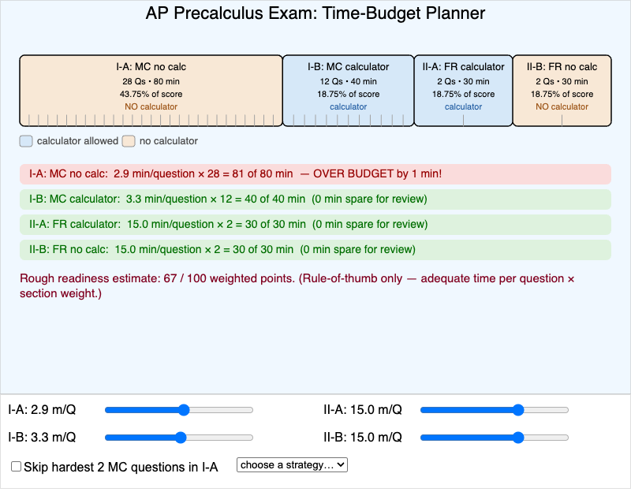

    ---

    Interactive p5.js MicroSim for ap exam timing planner.

    [Open MicroSim](./ap-exam-timing/index.md)

-   **Arithmetic vs Geometric Sequence Explorer**

    ---

    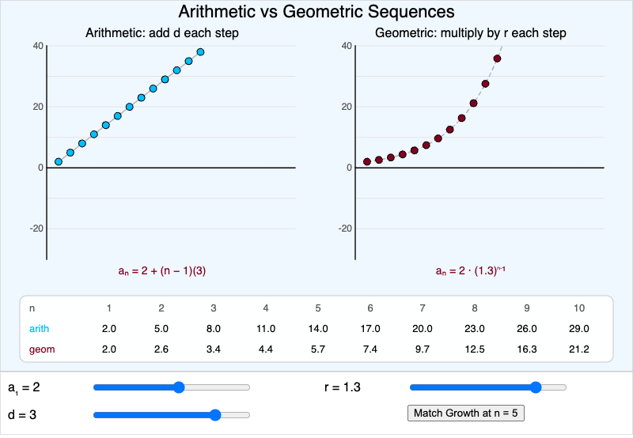

    ---

    Interactive p5.js MicroSim for arithmetic vs geometric sequence explorer.

    [Open MicroSim](./arithmetic-vs-geometric-explorer/index.md)

-   **Competing Models Comparison**

    ---

    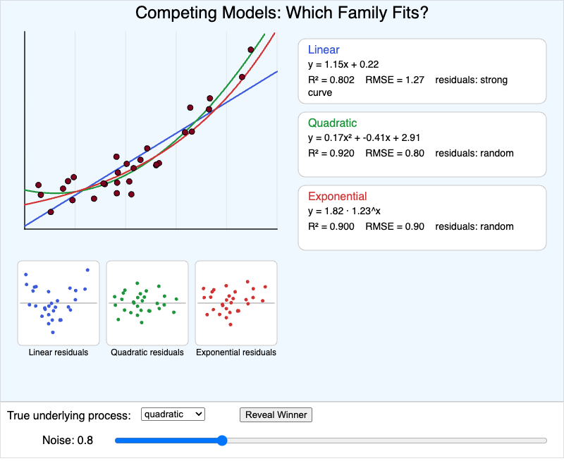

    ---

    Interactive p5.js MicroSim for competing models comparison.

    [Open MicroSim](./competing-models-comparison/index.md)

-   **Coordinate Plane Explorer**

    ---

    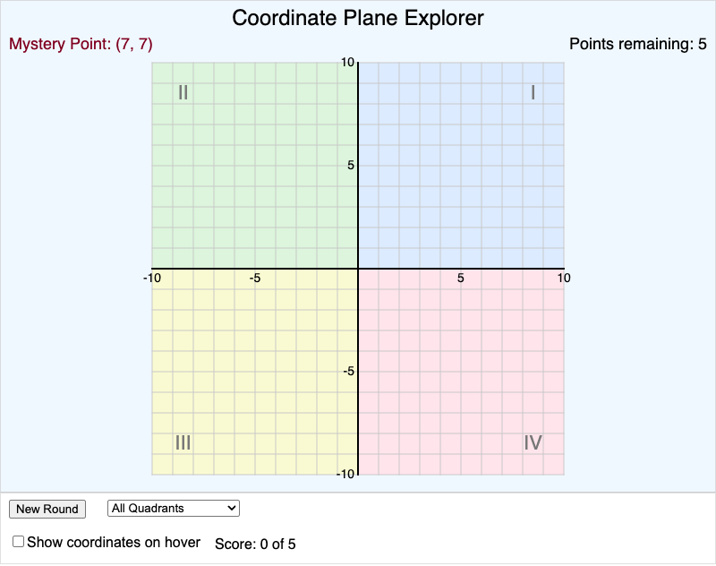

    ---

    Interactive p5.js MicroSim for coordinate plane explorer.

    [Open MicroSim](./coordinate-plane-explorer/index.md)

-   **Daylight Hours by Latitude**

    ---

    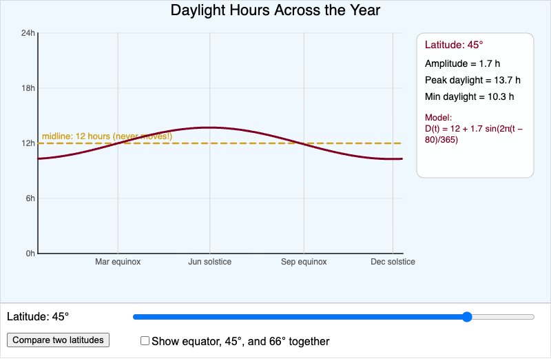

    ---

    Interactive p5.js MicroSim for daylight hours by latitude.

    [Open MicroSim](./daylight-hours-by-latitude/index.md)

-   **Discriminant Decision Tree**

    ---

    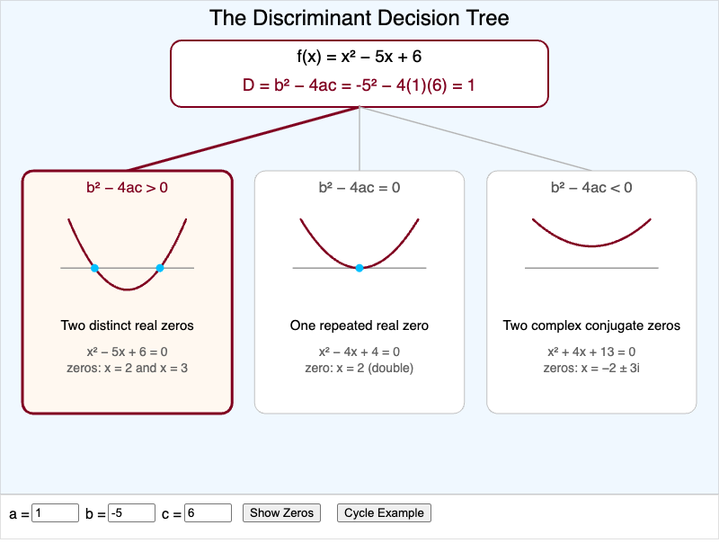

    ---

    Interactive p5.js MicroSim for discriminant decision tree.

    [Open MicroSim](./discriminant-decision-tree/index.md)

-   **Even and Odd Function Explorer**

    ---

    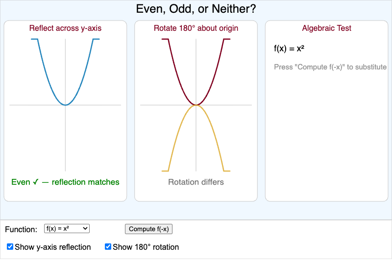

    ---

    Interactive p5.js MicroSim for even and odd function explorer.

    [Open MicroSim](./even-odd-explorer/index.md)

-   **Exponential and Logarithm as Inverse Reflections**

    ---

    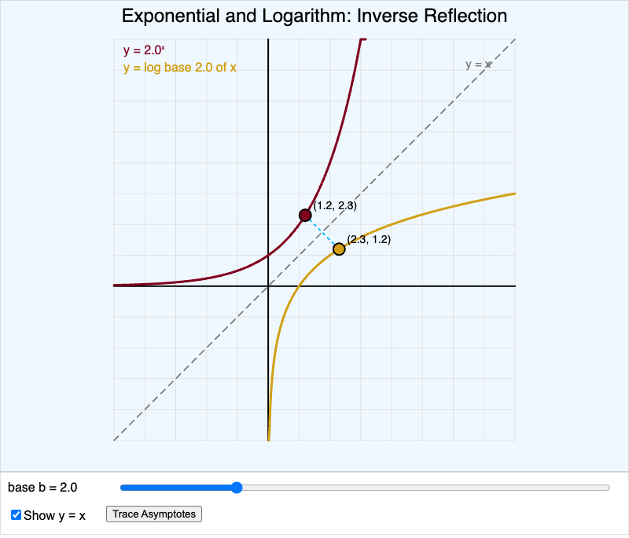

    ---

    Interactive p5.js MicroSim for exponential and logarithm as inverse reflections.

    [Open MicroSim](./exp-log-inverse-reflection/index.md)

-   **Exponential Growth vs Decay Explorer**

    ---

    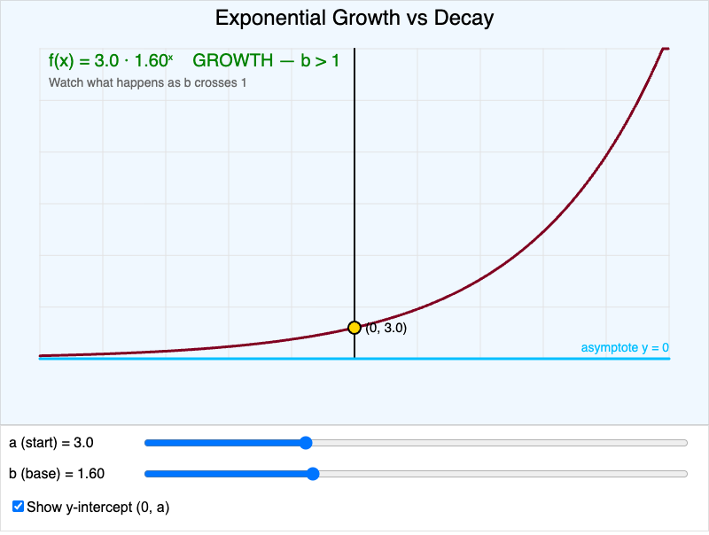

    ---

    Interactive p5.js MicroSim for exponential growth vs decay explorer.

    [Open MicroSim](./exponential-growth-vs-decay/index.md)

-   **Force and Displacement Workout**

    ---

    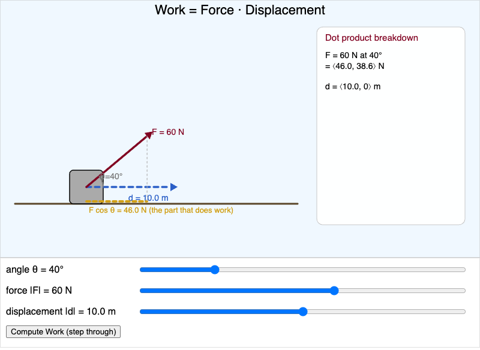

    ---

    Interactive p5.js MicroSim for force and displacement workout.

    [Open MicroSim](./force-displacement-work/index.md)

-   **Function Behavior Labeler**

    ---

    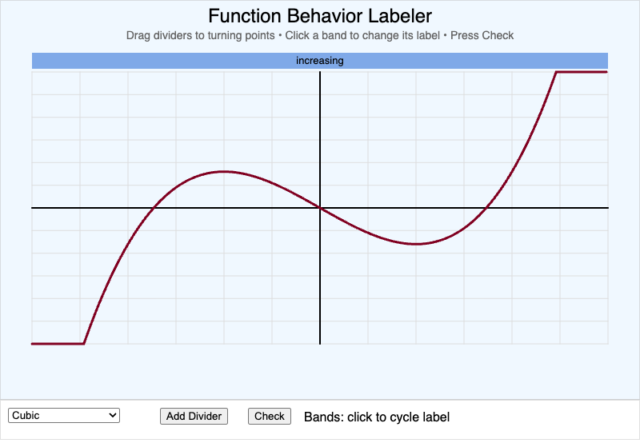

    ---

    Interactive p5.js MicroSim for function behavior labeler.

    [Open MicroSim](./function-behavior-labeler/index.md)

-   **Function Composition Pipeline**

    ---

    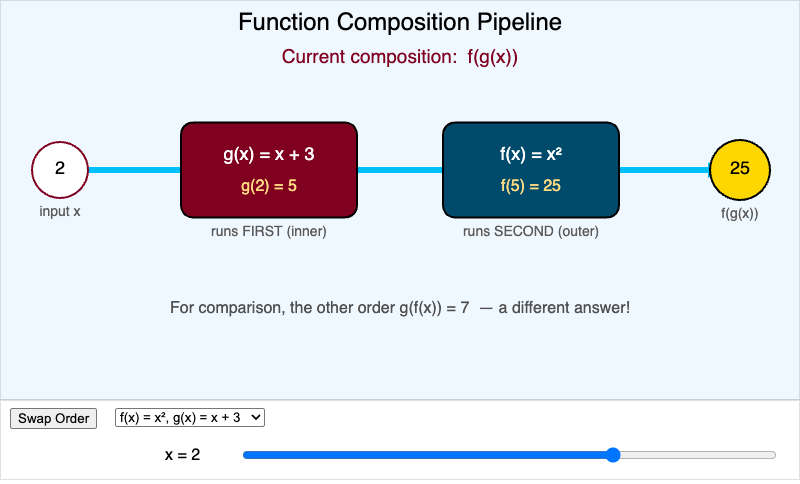

    ---

    Interactive p5.js MicroSim for function composition pipeline.

    [Open MicroSim](./function-composition-pipeline/index.md)

-   **Function Machine**

    ---

    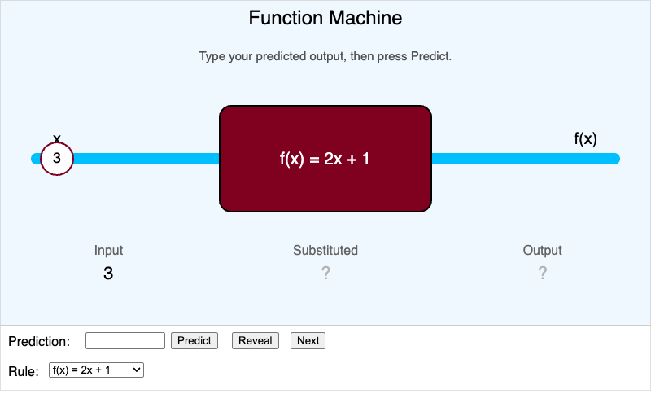

    ---

    Interactive p5.js MicroSim for function machine.

    [Open MicroSim](./function-machine/index.md)

-   **Graph Viewer**

    ---

    

    ---

    Interactive viewer to explore the learning graph for the AP Pre-Calculus course.

    [Open MicroSim](./graph-viewer/index.md)

-   **Half-Life and Doubling-Time Visualizer**

    ---

    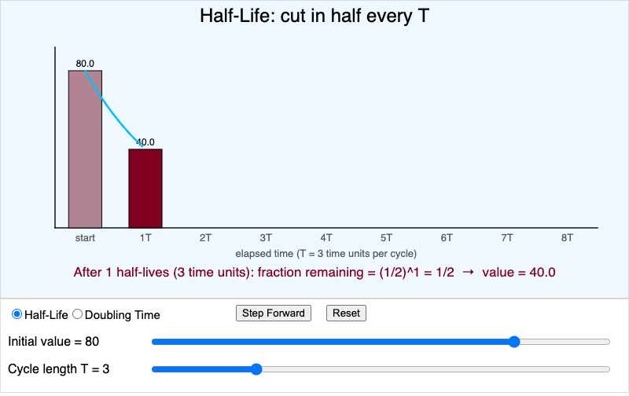

    ---

    Interactive p5.js MicroSim for half-life and doubling-time visualizer.

    [Open MicroSim](./halflife-doubling-visualizer/index.md)

-   **Identity Verification Worked Examples**

    ---

    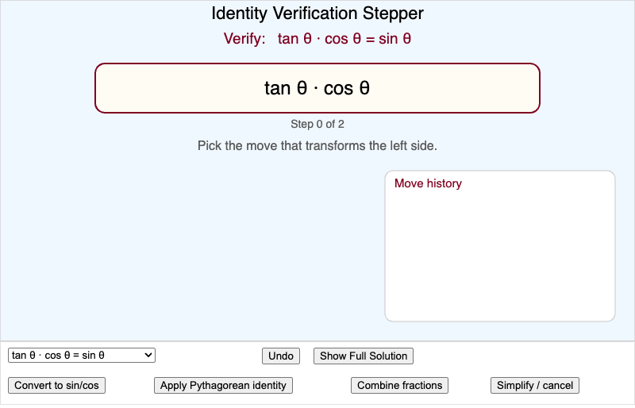

    ---

    Interactive p5.js MicroSim for identity verification worked examples.

    [Open MicroSim](./identity-verification-stepper/index.md)

-   **Inverse as Reflection Across y = x**

    ---

    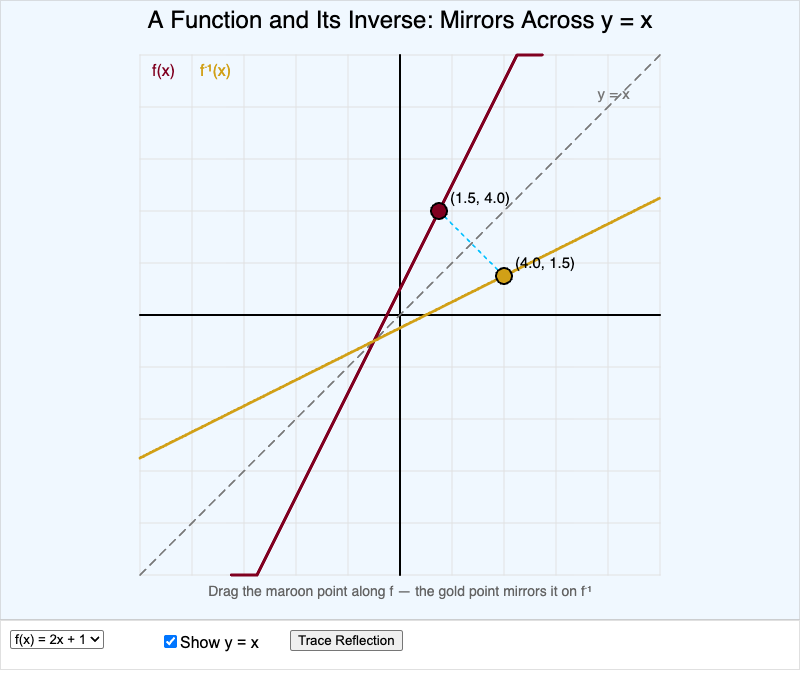

    ---

    Interactive p5.js MicroSim for inverse as reflection across y = x.

    [Open MicroSim](./inverse-reflection-yx/index.md)

-   **Inverse Trig Graph Explorer**

    ---

    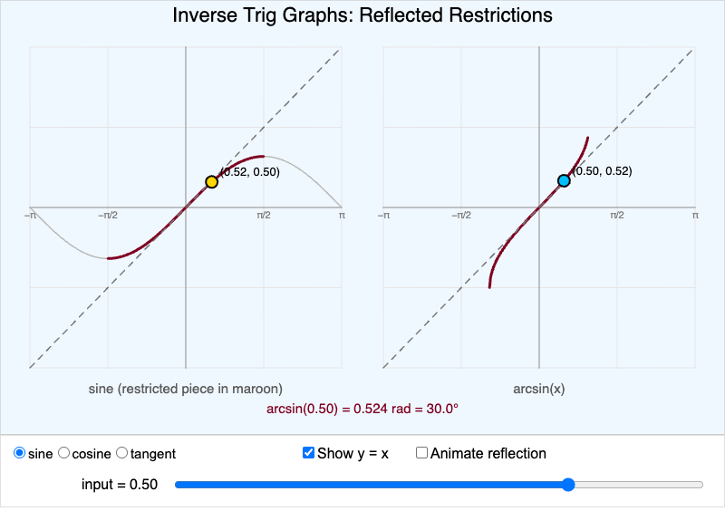

    ---

    Interactive p5.js MicroSim for inverse trig graph explorer.

    [Open MicroSim](./inverse-trig-graphs/index.md)

-   **Leading Term Test Sandbox**

    ---

    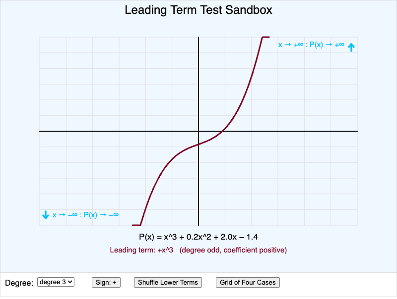

    ---

    Interactive p5.js MicroSim for leading term test sandbox.

    [Open MicroSim](./leading-term-test-sandbox/index.md)

-   **Linear Transformation Visualizer**

    ---

    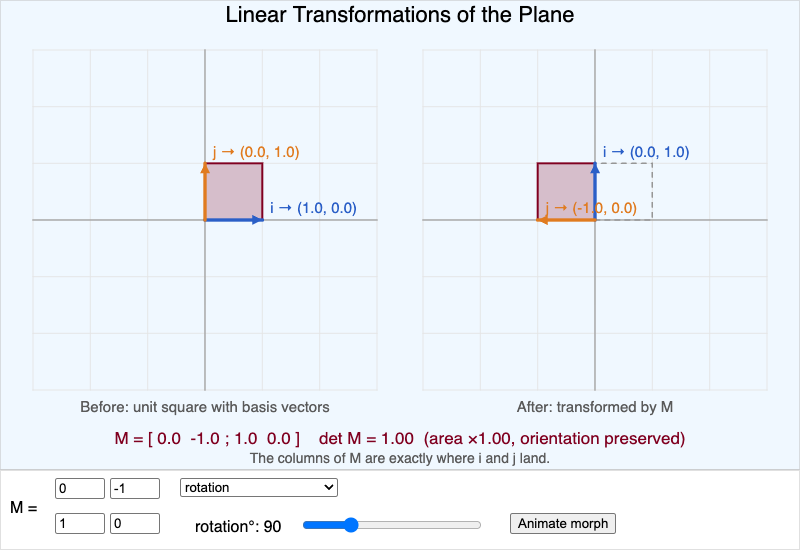

    ---

    Interactive p5.js MicroSim for linear transformation visualizer.

    [Open MicroSim](./linear-transformation/index.md)

-   **Linear vs Semi-Log Plot of Exponential Data**

    ---

    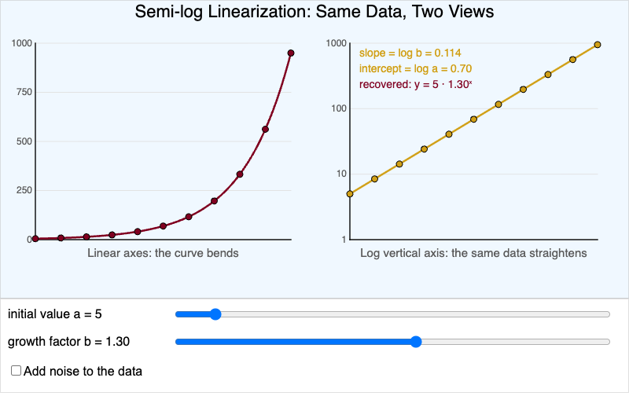

    ---

    Interactive p5.js MicroSim for linear vs semi-log plot of exponential data.

    [Open MicroSim](./semilog-linearization/index.md)

-   **Matrix Multiplication Walkthrough**

    ---

    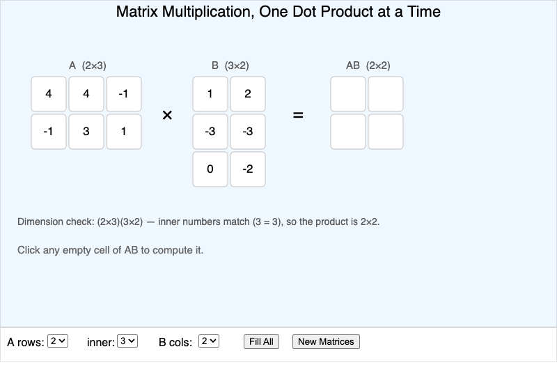

    ---

    Interactive p5.js MicroSim for matrix multiplication walkthrough.

    [Open MicroSim](./matrix-multiplication/index.md)

-   **Notation Translator**

    ---

    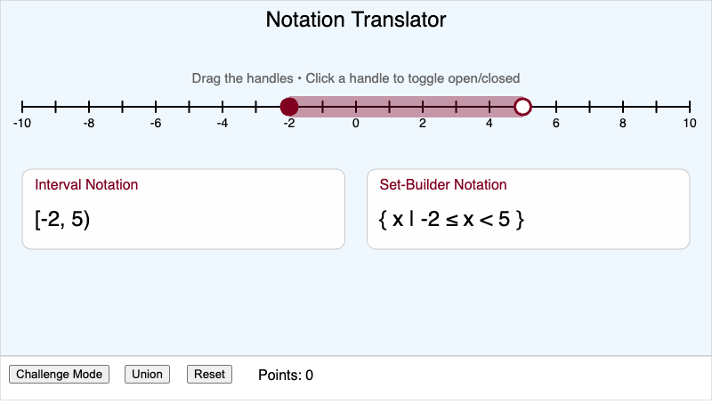

    ---

    Interactive p5.js MicroSim for notation translator.

    [Open MicroSim](./notation-translator/index.md)

-   **Polar Curve Gallery**

    ---

    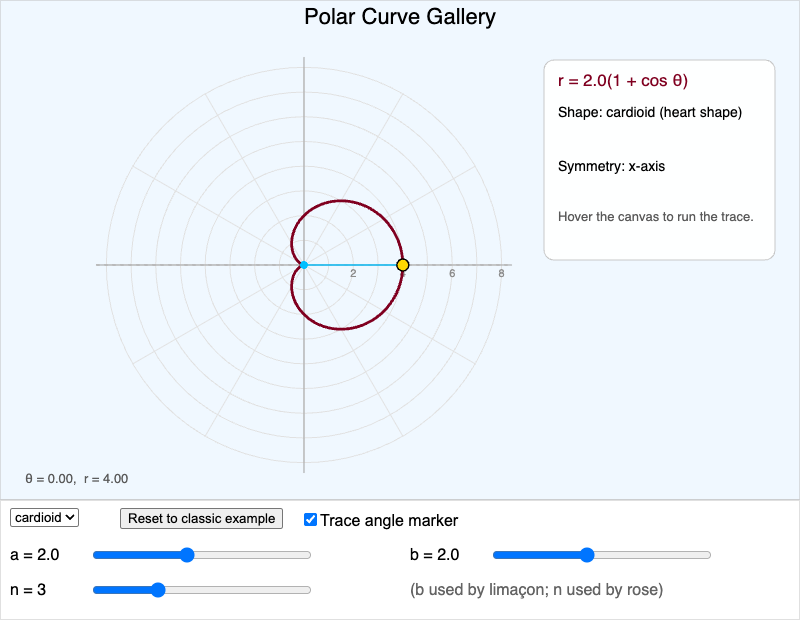

    ---

    Interactive p5.js MicroSim for polar curve gallery.

    [Open MicroSim](./polar-curve-gallery/index.md)

-   **Polar-Rectangular Converter**

    ---

    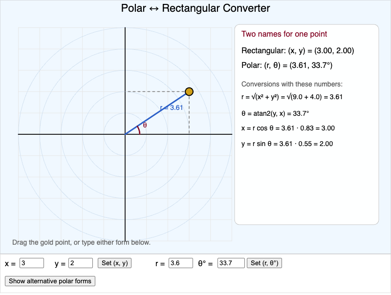

    ---

    Interactive p5.js MicroSim for polar-rectangular converter.

    [Open MicroSim](./polar-rectangular-converter/index.md)

-   **Polynomial Graph Builder**

    ---

    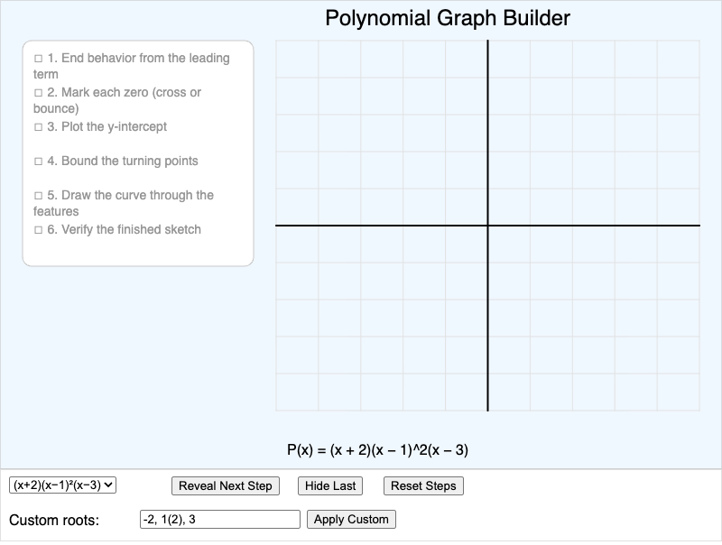

    ---

    Interactive p5.js MicroSim for polynomial graph builder.

    [Open MicroSim](./polynomial-graph-builder/index.md)

-   **Projectile Motion Simulator**

    ---

    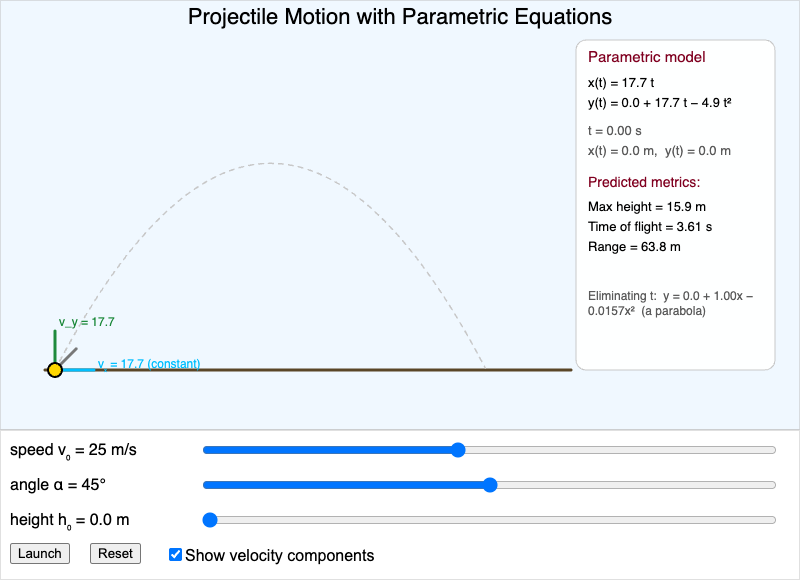

    ---

    Interactive p5.js MicroSim for projectile motion simulator.

    [Open MicroSim](./projectile-motion/index.md)

-   **Rational Function Explorer**

    ---

    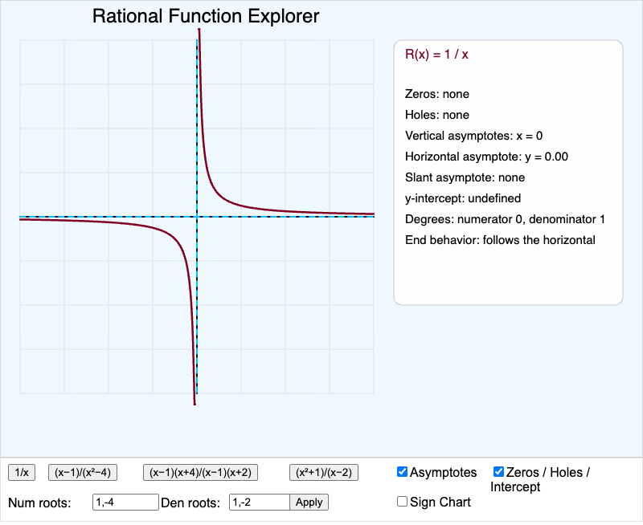

    ---

    Interactive p5.js MicroSim for rational function explorer.

    [Open MicroSim](./rational-function-explorer/index.md)

-   **Real Number System Hierarchy**

    ---

    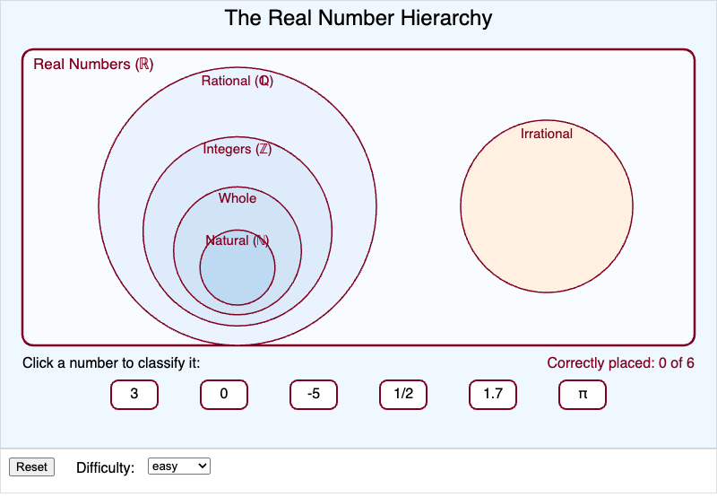

    ---

    Interactive p5.js MicroSim for real number system hierarchy.

    [Open MicroSim](./real-number-hierarchy/index.md)

-   **Residual Plot Validator**

    ---

    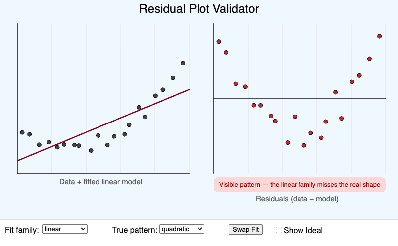

    ---

    Interactive p5.js MicroSim for residual plot validator.

    [Open MicroSim](./residual-plot-validator/index.md)

-   **Residuals and the Line of Best Fit**

    ---

    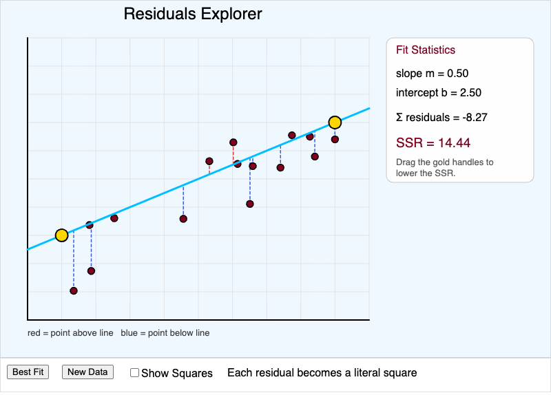

    ---

    Interactive p5.js MicroSim for residuals and the line of best fit.

    [Open MicroSim](./residuals-explorer/index.md)

-   **Right Triangle SOH-CAH-TOA Visualizer**

    ---

    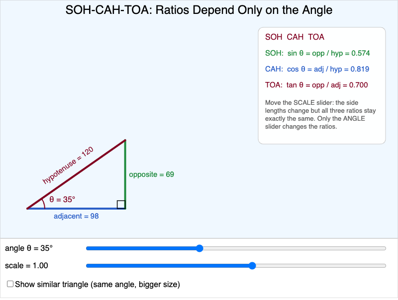

    ---

    Interactive p5.js MicroSim for right triangle soh-cah-toa visualizer.

    [Open MicroSim](./right-triangle-soh-cah-toa/index.md)

-   **Secant Line Explorer**

    ---

    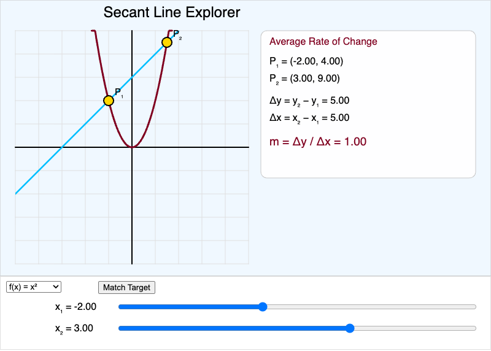

    ---

    Interactive p5.js MicroSim for secant line explorer.

    [Open MicroSim](./secant-line-explorer/index.md)

-   **Sinusoidal Model Builder**

    ---

    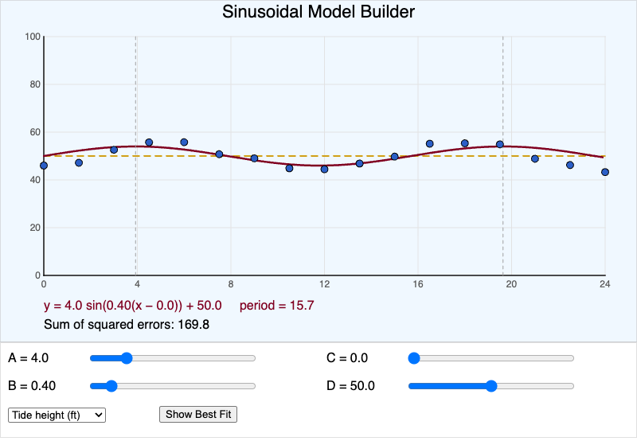

    ---

    Interactive p5.js MicroSim for sinusoidal model builder.

    [Open MicroSim](./sinusoidal-model-builder/index.md)

-   **Sinusoidal Parameter Explorer**

    ---

    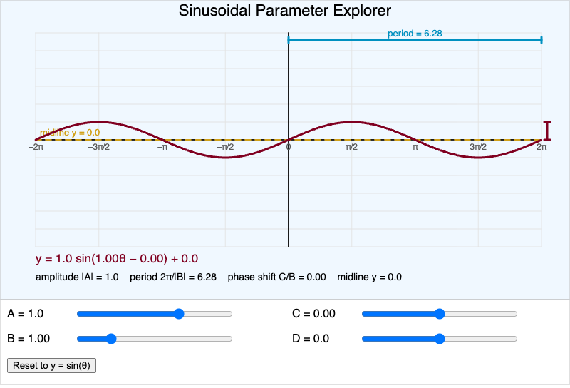

    ---

    Interactive p5.js MicroSim for sinusoidal parameter explorer.

    [Open MicroSim](./sinusoidal-parameter-explorer/index.md)

-   **Six Trig Graph Comparison**

    ---

    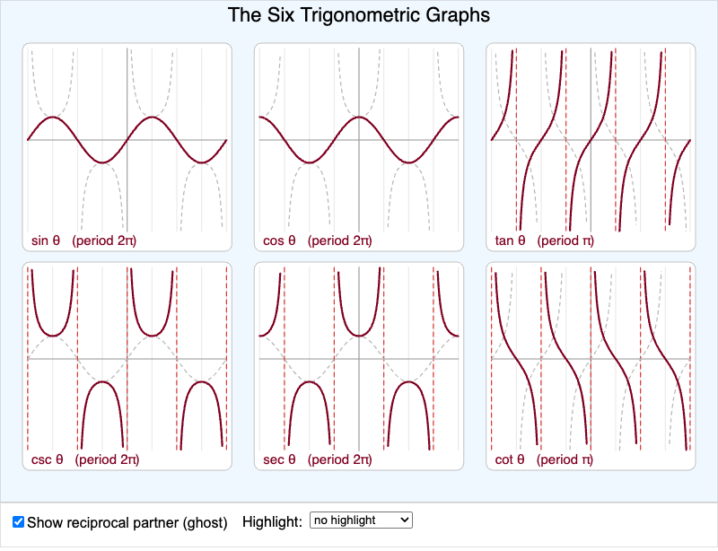

    ---

    Interactive p5.js MicroSim for six trig graph comparison.

    [Open MicroSim](./six-trig-graphs/index.md)

-   **Six-Function Evaluation Wheel**

    ---

    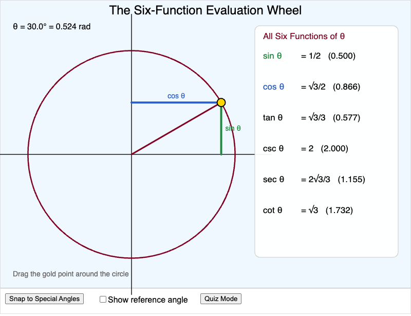

    ---

    Interactive p5.js MicroSim for six-function evaluation wheel.

    [Open MicroSim](./six-function-evaluation-wheel/index.md)

-   **Standard Position and Reference Angles Explorer**

    ---

    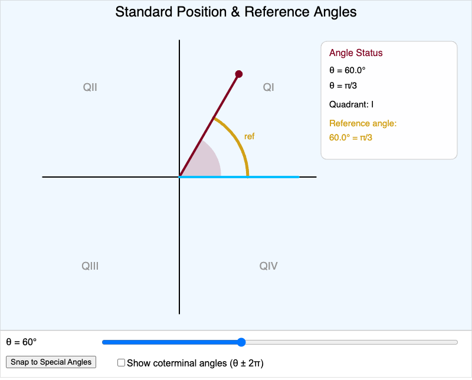

    ---

    Interactive p5.js MicroSim for standard position and reference angles explorer.

    [Open MicroSim](./standard-position-reference-angles/index.md)

-   **Sum Formula Geometric Proof**

    ---

    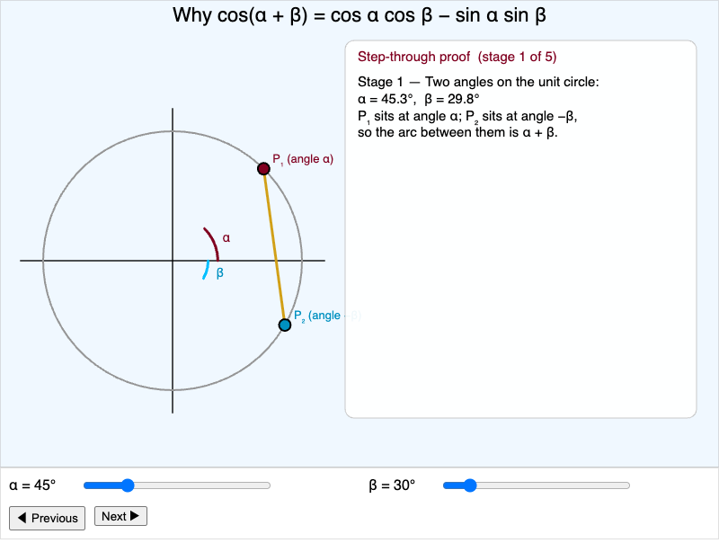

    ---

    Interactive p5.js MicroSim for sum formula geometric proof.

    [Open MicroSim](./sum-formula-proof/index.md)

-   **Synthetic Division Animator**

    ---

    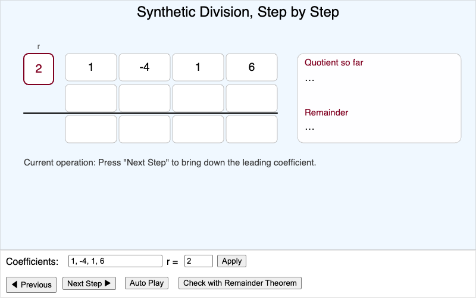

    ---

    Interactive p5.js MicroSim for synthetic division animator.

    [Open MicroSim](./synthetic-division-animator/index.md)

-   **The Four Shapes of Change**

    ---

    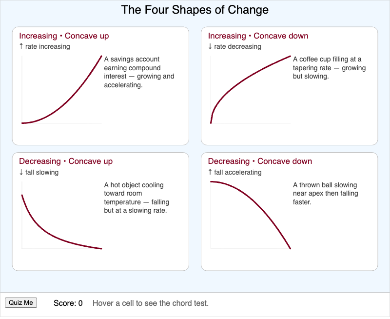

    ---

    Interactive p5.js MicroSim for the four shapes of change.

    [Open MicroSim](./four-shapes-of-change/index.md)

-   **Three Forms of a Parabola**

    ---

    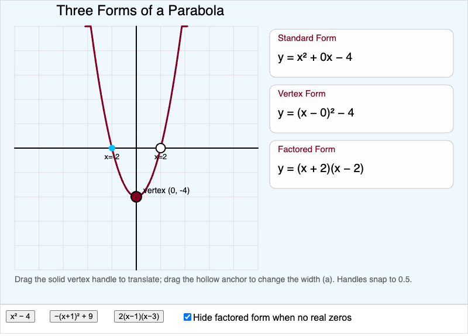

    ---

    Interactive p5.js MicroSim for three forms of a parabola.

    [Open MicroSim](./three-forms-parabola/index.md)

-   **Three-Form Translator**

    ---

    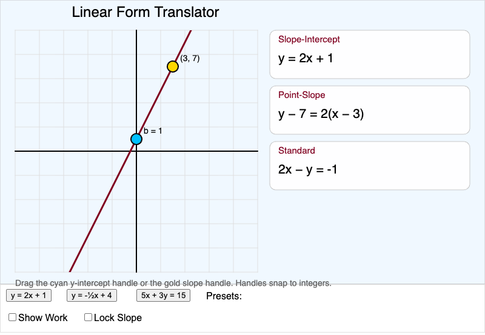

    ---

    Interactive p5.js MicroSim for three-form translator.

    [Open MicroSim](./linear-form-translator/index.md)

-   **Transformation Composer**

    ---

    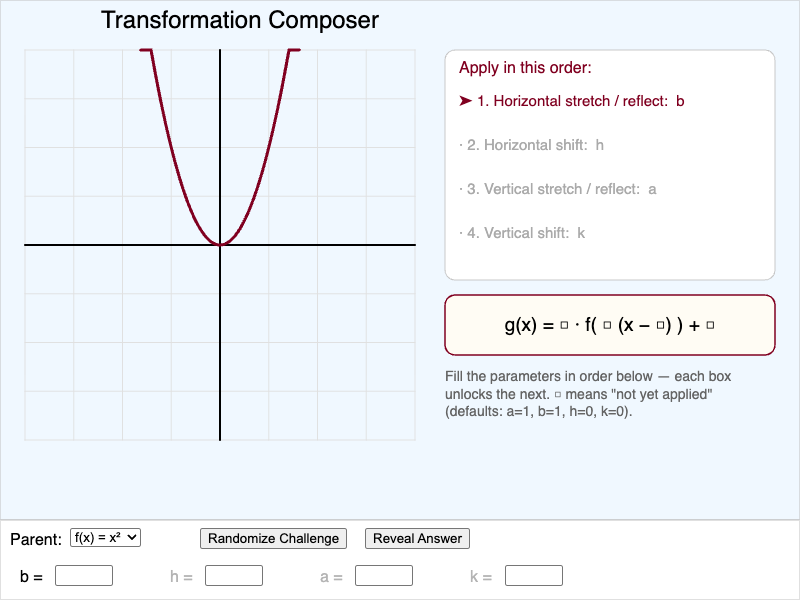

    ---

    Interactive p5.js MicroSim for transformation composer.

    [Open MicroSim](./transformation-composer/index.md)

-   **Transformation Sandbox**

    ---

    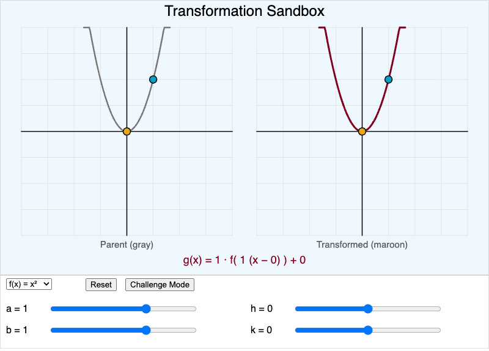

    ---

    Interactive p5.js MicroSim for transformation sandbox.

    [Open MicroSim](./transformation-sandbox/index.md)

-   **Trig Equation Solution Unit Circle**

    ---

    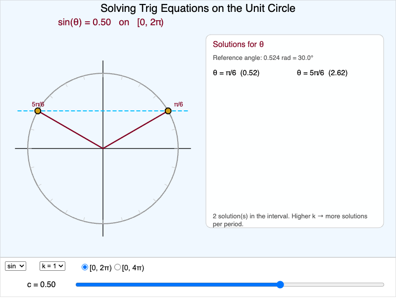

    ---

    Interactive p5.js MicroSim for trig equation solution unit circle.

    [Open MicroSim](./trig-equation-unit-circle/index.md)

-   **Unit Circle to Sine Graph Animation**

    ---

    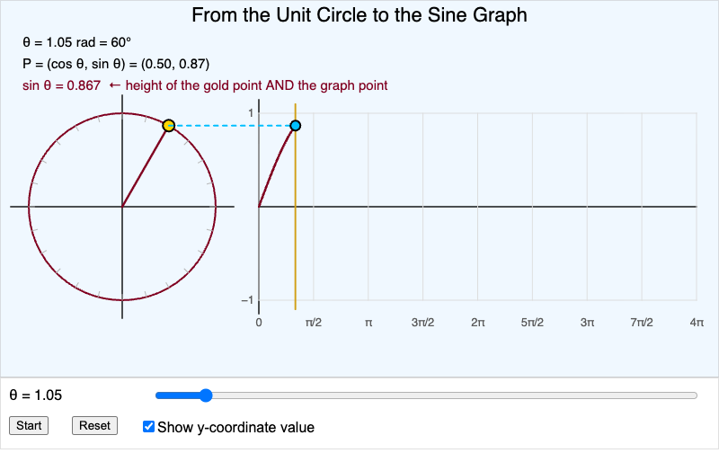

    ---

    Interactive p5.js MicroSim for unit circle to sine graph animation.

    [Open MicroSim](./circle-to-sine-graph/index.md)

-   **Unit Circle with Special Angles and Coordinates**

    ---

    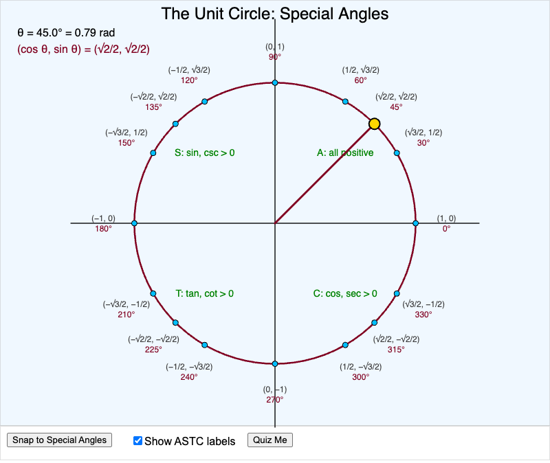

    ---

    Interactive p5.js MicroSim for unit circle with special angles and coordinates.

    [Open MicroSim](./unit-circle-special-angles/index.md)

-   **Vector Operations Playground**

    ---

    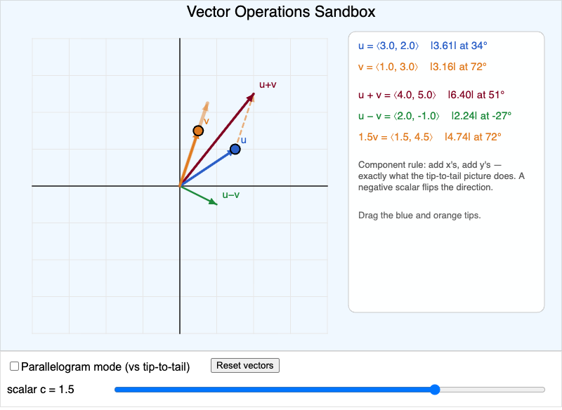

    ---

    Interactive p5.js MicroSim for vector operations playground.

    [Open MicroSim](./vector-operations/index.md)

-   **Vertical and Horizontal Line Tests Compared**

    ---

    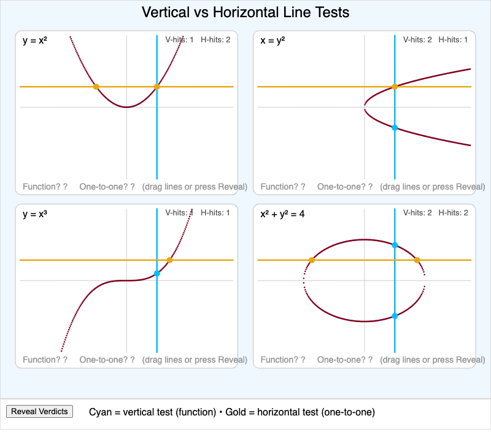

    ---

    Interactive p5.js MicroSim for vertical and horizontal line tests compared.

    [Open MicroSim](./line-tests-compared/index.md)

-   **Vertical Line Test Explorer**

    ---

    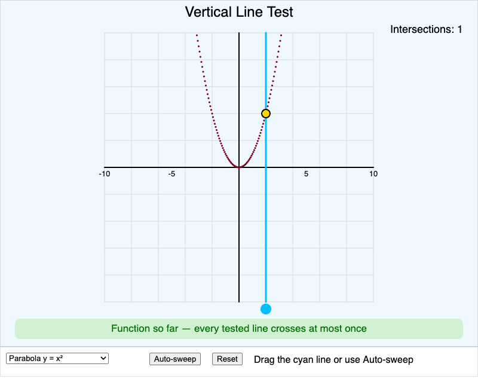

    ---

    Interactive p5.js MicroSim for vertical line test explorer.

    [Open MicroSim](./vertical-line-test/index.md)

